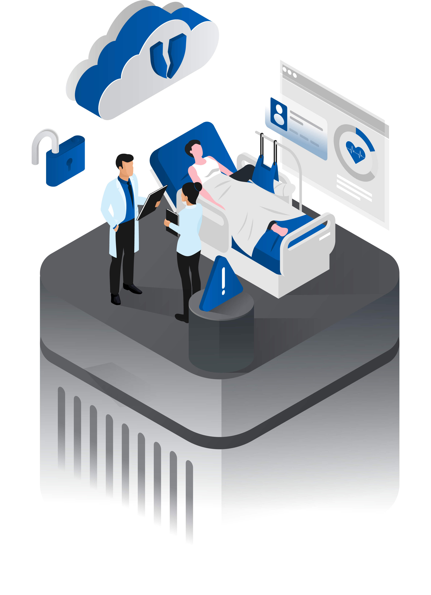
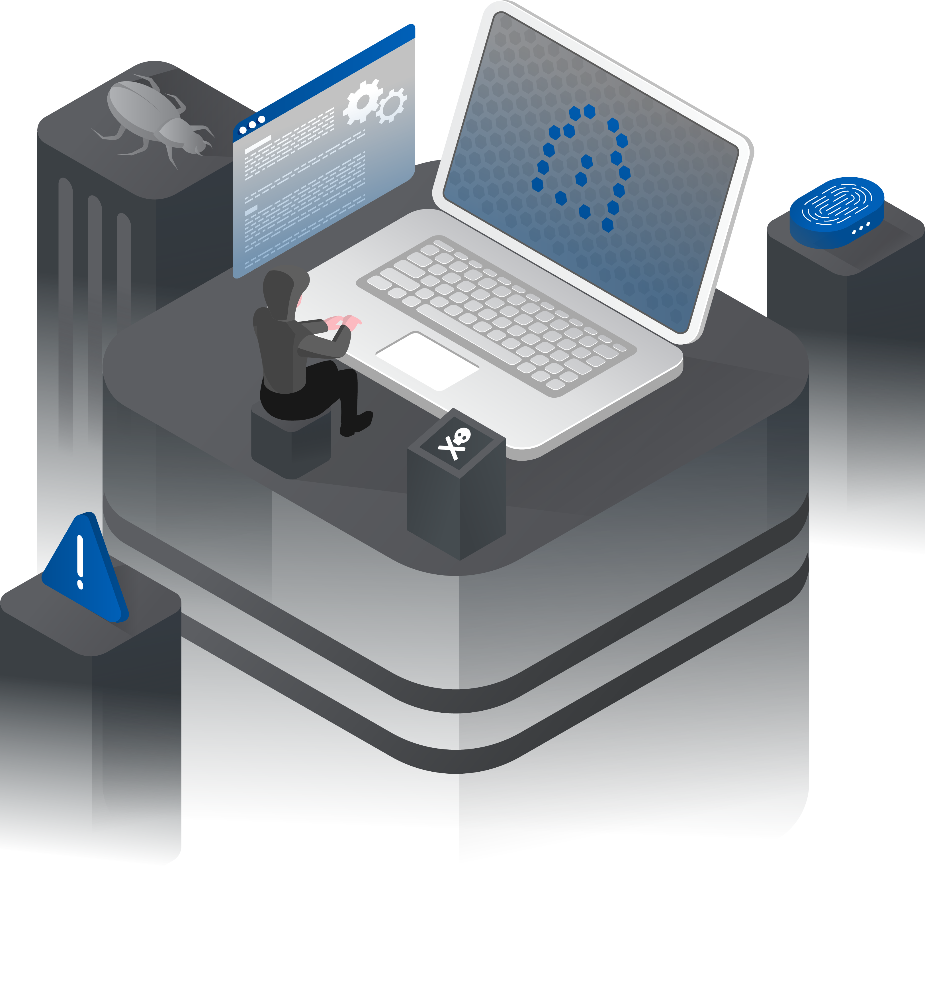

<h1 align="left">👋 Hello, I'm Robert</h1>
<h3 align="left">Computer Scientist | Industrial Engineer | Healthcare Nerd</h3>   
  </a>
  <!---

     --->
      <!---   --->

<!---  

  --->
 

  

    
I am passionate about my work in healthcare enhancing patient safety, improving clinical & financial outcomes, through technology-driven solutions. With a Bachelor's in Computer Science (cybersecurity focus) from Georgia Tech and a Master's in Industrial Engineering from Lehigh University, I've built a career leading transformative initiatives at organizations like Emory, Geisinger, Highmark/Allegheny Health Network, and multiple startups.

    
In today's challenging economic landscape, providers often struggle with unreliable reimbursements, infrastructure vulnerabilities, and maintaining high-quality care delivery amid limited resources. My unique blend of technical expertise and healthcare systems knowledge allows me to address these issues in innovative ways, from automating workflows to enhancing security measures. This GitHub serves as a hub for sharing tools, insights, and projects that have supported my mission to make healthcare more efficient, secure, and patient-centered.

  

  

    
  

  

<h2 align="left"> Revenue Cycle Management</h2>

Revenue Cycle Management (RCM) is the unfortunate counterweight to a payer-led financial system, where guidelines shift like the house rules in a high-stakes poker game—constantly evolving, even among similar insurance brands, and always introducing new barriers that stack the deck against providers seeking fair reimbursement.

RCM is also the lifeblood for any provider group or health system. It's often fee-for-service, but in some cases, a payer and provider might negotiate shared outcomes and how to split the allotted insurance reimbursement. But only if the provider hits those target outcomes; otherwise, it's all-in on a bluff—the house (payer) rakes in the pot, leaving the provider with empty pockets. The industry even has its shady bookies lurking in the shadows, taking their cut of the winnings (aka: many RCM vendors) who still demand a percentage of the reimbursement, no matter the hand. 

While this landscape is primed for Agentic AI and all manner of automation, simply understanding your data and maximizing revenue can feel like drawing dead. Here are a few repos to help hack your claims:

  

  

    
  

 

  

<h2 align="left">Information Security</h2>

Cybersecurity is a critical pillar of clinical outcomes and cost reduction in care delivery. The solutions and hardware that providers purchase are rarely designed with security in mind. In healthcare's urgent push for better outcomes, this oversight often gets buried, turning those tools into entrenched fixtures that rack up unnecessary overhead costs through vulnerabilities and patches./p>

Hospitals and providers are strapped for cash (as highlighted in the RCM dynamics above), compelling leadership to gamble with higher risks and skimp on a robust security posture. A strong supply chain and information security program remains a luxury for the select few who are well-positioned or hold enough market share to negotiate favorable payer contracts.

Sharing some fun repos for those curious about the porous financial products flooding the market. I’ll aim to get a Change Healthcare simulation up by 2026.

  

  

    
  

  
 

<h2 align="left">🎓 Recognition & Training</h2>
  
- Georgia Institute of Technology - Bachelors in Computer Science (infosec focus)
- Lehigh University - Master in Industrial Engineering (healthcare focus)
- Lean Six Sigma : Master Black Belt
- OffSec: OSCP, OSCP+, OSEP, OSWE
- HTB: CPTS, CWEE
- Misc: CISM, Azure Cybersecurity Architect + other cloud certs

- 2024 & 2025 KLAS Emerging Technology Council
- 2023 KLAS K2 Summit Points of Light Recipient 
- 2023 KLAS RCM Summit Keynote

<!-- **Hack The Box**

*(Replace `12345` with your actual HTB ID — this badge updates automatically)* -->
---
<h2 align="left">🛠 Skills</h2>

- **Executive:** Leading Global Teams, Delivering on OpEx, Expert knowledge of healthcare ops & finance
- **Programming Languages:** Python, Bash, SQL
- **Networking & Security:** TCP/IP, Firewalls, IDS/IPS, Threat Modeling
- **Penetration Testing:** Obfuscation, Web Apps, APIs, Network Exploitation, Privilege Escalation, Kerberoasting - some C2 deployment
- **Cloud & Infrastructure:** Azure, AWS, Linux Server Hardening, IoT
  
 

<!--
<h2 align="left">⚙️ Tools & Tech</h2>

In progress

---
<h2 align="left">📊 GitHub Stats</h2>

  
 -->
