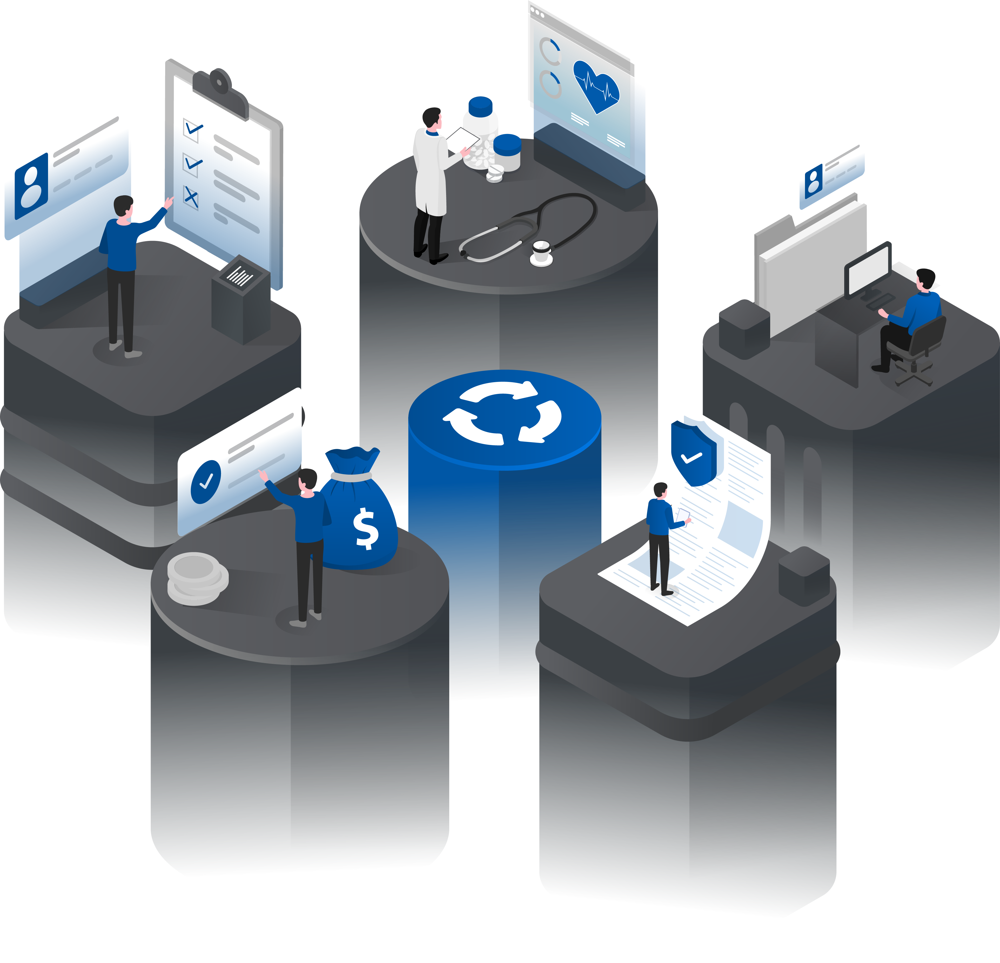

<h1 style="text-align: left;">👋 Hello, I'm Robert</h1>
<h3 style="text-align: left;">Computer Scientist | Industrial Engineer | Healthcare Nerd</h3>

  
  
  

 

  

    
I am a healthcare innovation leader passionate about enhancing patient safety, clinical outcomes, and satisfaction through technology-driven solutions. With a Bachelor's in Computer Science (cybersecurity focus) from Georgia Tech and a Master's in Industrial Engineering from Lehigh University, I've built a career leading transformative initiatives at organizations like Emory, Geisinger, Highmark/Allegheny Health Network, and multiple startups.

    
In today's challenging economic landscape, providers often struggle with unreliable reimbursements, infrastructure vulnerabilities, and maintaining high-quality care amid limited resources. My unique blend of technical expertise and healthcare systems knowledge allows me to address these issues in innovative ways, from automating workflows to enhancing security measures. This GitHub serves as a hub for sharing tools, insights, and projects that have supported my mission to make healthcare more efficient, secure, and patient-centered.

  

  

     <!-- Rounded widths to integers for better rendering -->
  

---
<h2 style="text-align: left;">🎓 Certifications & Badges</h2>
Here are some platforms where I’m developing and proving my skills:
**OffSec**

*(Add more as you earn them)*
<!-- **Hack The Box**

*(Replace `12345` with your actual HTB ID — this badge updates automatically)* -->
---
<h2 style="text-align: left;">🛠 Skills</h2>
- **Penetration Testing:** Web Apps, APIs, Network Exploitation, Privilege Escalation
- **Programming Languages:** Python, Bash, JavaScript
- **Networking & Security:** TCP/IP, Firewalls, IDS/IPS, Threat Modeling
- **Cloud & Infrastructure:** AWS, Linux Server Hardening, Container Security
---
<h2 style="text-align: left;">⚙️ Tools & Tech</h2>

---
<h2 style="text-align: left;">📊 GitHub Stats</h2>

---
